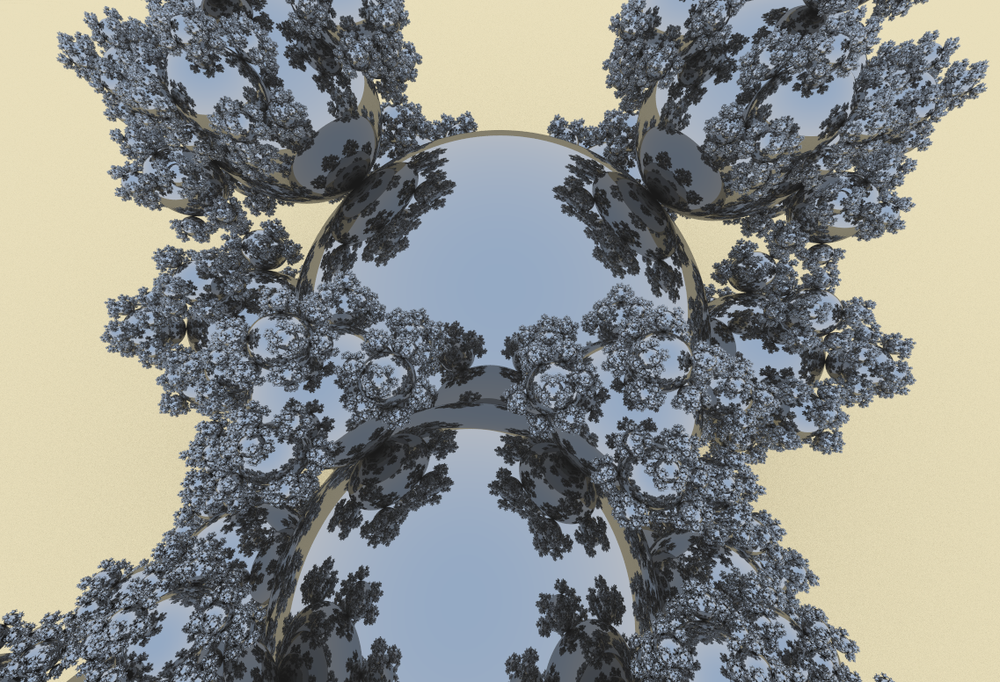
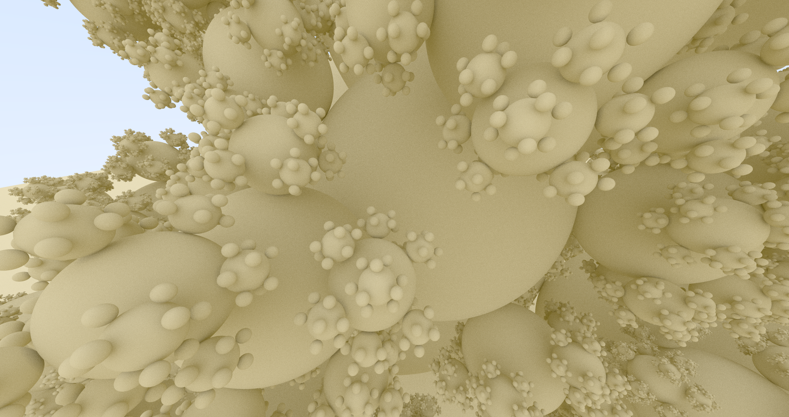
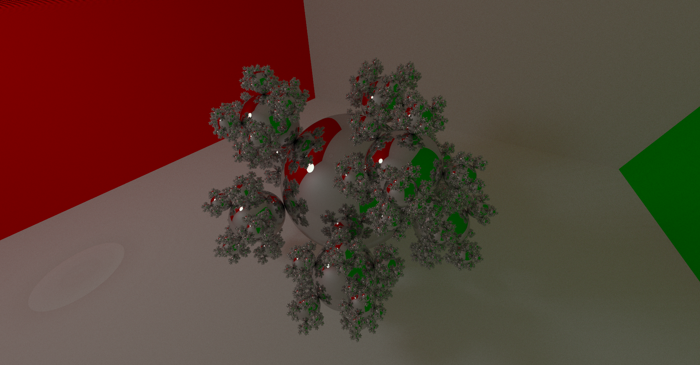
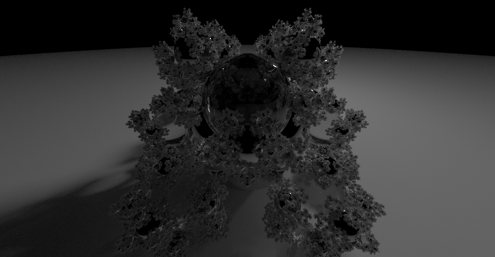

# wgpu-rs Path Tracer
A path tracer written in Rust + WebGPU. Kinda works... Maybe more to come.

## Building on Windows
1. Download [shaderc](https://github.com/google/shaderc#downloads) and unzip to a location e.g. `C:\shaderc`
2. Copy `shaderc_shared.lib` from `shaderc\lib` to `shaderc\bin`
3. Copy `shaderc_shared.lib` from `shaderc\lib` to your rust windows bin folder e.g. `C:\Users\USER\.rustup\toolchains\stable-x86_64-pc-windows-msvc\bin`
4. Add enviroment variable `SHADERC_LIB_DIR` with a value of `path\to\shaderc\bin`

## Images

